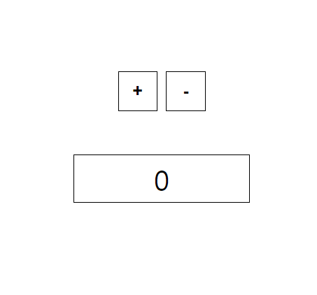

## 2019 UOS LikeLion React Tutorial

This repository is Tutorial Codes for React Tutorial. We will learn about React through this class. Here's what you'll learn in class.

1. Set React Development Environment
2. React Components
3. Components Styling
4. State & Props
5. LifeCycle API
6. React Hooks
7. Redux
8. React-Router

In learning this class, we will proceed with the telephone book project and counter project. The result of the project is shown in the picture below.

The curriculum is like below and will continue to be added. All the learning materials were posted on Notion. The React Tutorial Course and Plans can be found on [the following page](https://www.notion.so/React-Tutorial-Process-392157ed379847f9a4dd6c9d4d3af4ac).

1. [React Tutorial (1) - 리액트 개념 및 개발 환경 설정](https://www.notion.so/React-Tutorial-1-534728c8a74740448ba6d39dbfe695a2)
2. [React Tutorial (2) - React Components](https://www.notion.so/React-Tutorial-2-React-Components-67b83d89c4e94f9cad77614329da4964)
3. [React Tutorial (3) - Split Component & Styling](https://www.notion.so/React-Tutorial-3-Split-Component-Styling-8a834d2740e74024895cda40cb67d766)
4. [React Tutorial (4) - State & Props](https://www.notion.so/React-Tutorial-4-State-Props-2514653ff2d6480f9a413ea0c69f70aa)
5. [React Tutorial (5) - State & Props 전화번호부에 적용하기](https://www.notion.so/React-Tutorial-5-State-Props-fc5cd2380bca4403bcbb89335520381f)
6. [React Tutorial (6) - LifeCycle API](https://www.notion.so/React-Tutorial-6-LifeCycle-API-7e2d8361803f4d50a5bb8d65e332557b)
7. [React Tutorial (7) - React Hooks](https://www.notion.so/React-Tutorial-7-React-Hooks-5c744b80aeb440cc9ca7e559ba40a6ed)
8. [React Tutorial (8) - React Hooks 전화번호부에 적용하기](https://www.notion.so/React-Tutorial-8-React-Hooks-48f7979df91c402dac6faa74cf7f9437)
9. [React Tutorial (9) - React Redux](https://www.notion.so/React-Tutorial-9-React-Redux-2079199aebfd437cbd342cb02949bc95)